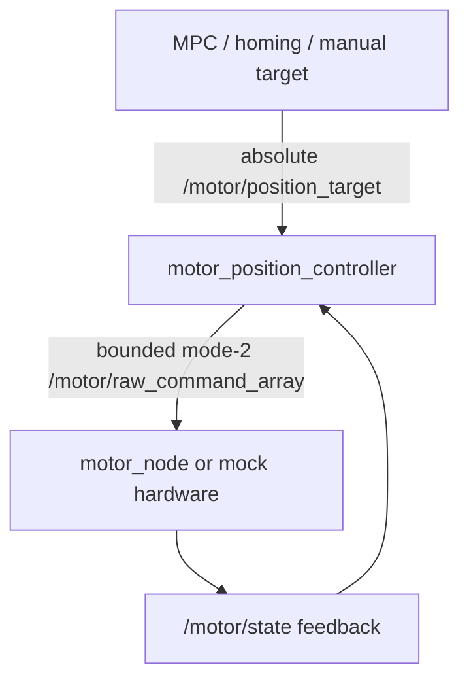

# ROS 2 Dual-section Continuum Robot

ROS 2 Jazzy control and research workspace for a two-section, six-tendon
continuum robot. The repository contains the physical motor/IMU drivers,
calibration-driven PCC model, state and safety estimation, AprilTag fusion,
QP MPC, and MuJoCo kinematic visualization.

## Fixed physical conventions

- Chain order: `base -> section2 -> section1 -> tip`.
- Section 1 motors: `1, 3, 5`; section 2 motors: `2, 4, 6`.
- Section 1 PCC slots: `[DL1, DL2, DL3] = [tendon5, tendon3, tendon1]`.
- Section 2 PCC slots: `[DL1, DL2, DL3] = [tendon4, tendon2, tendon6]`.
- All geometry, direction and limits come from
  `robot_bringup/config/robot_calibration.yaml`.

## Final motor execution architecture

The MS42DDC manufacturer protocol mode 2 is a **relative displacement**
command. It is not an absolute motor setpoint. MPC and application nodes must
therefore never publish directly to the raw mode-2 topic.



The controller starts disabled. Enabling requires complete fresh feedback and,
for real hardware, a fresh `SafetyState` with `safe_to_control=true`. Target,
feedback, safety and motion-batch timeouts actively publish stop commands and
latch a controller fault.

## Build

```bash
cd ~/ros_robot1_ws
source /opt/ros/jazzy/setup.bash
rosdep install --from-paths src --ignore-src -r -y
colcon build --symlink-install
source install/setup.bash
```

## Closed-loop verification without hardware

The default launch uses deterministic mock motors, does not access SocketCAN,
and still starts disarmed.

```bash
ros2 launch robot_bringup motor_control.launch.py
```

Check that six feedback streams and the controller state are present:

```bash
ros2 topic echo /motor/state
ros2 topic echo /motor/position_control_state
```

Arm the software position controller:

```bash
ros2 service call /motor_controller/set_enabled \
  robot_interfaces/srv/SetMotorControlEnabled "{enable: true}"
```

Publish a complete absolute target heartbeat. All six motors are required in
every external target message.

```bash
ros2 topic pub -r 10 /motor/position_target \
  robot_interfaces/msg/MotorPositionTargetArray \
  "{enable: true, source: manual_mock_test, targets: [
    {motor_id: 1, position_deg: 12.0, max_speed_rad_s: 0.3},
    {motor_id: 2, position_deg: 12.0, max_speed_rad_s: 0.3},
    {motor_id: 3, position_deg: 12.0, max_speed_rad_s: 0.3},
    {motor_id: 4, position_deg: 12.0, max_speed_rad_s: 0.3},
    {motor_id: 5, position_deg: 12.0, max_speed_rad_s: 0.3},
    {motor_id: 6, position_deg: 12.0, max_speed_rad_s: 0.3}]}"
```

Stop the publisher to verify that the 0.5 s target watchdog stops the mock
motors, disables the controller and latches a fault. Recovery order is:

1. restore feedback and safety;
2. clear the fault;
3. explicitly enable the controller;
4. publish a fresh complete target.

## Real motor execution

Start the IMU, state estimator, vision and safety chain first. Only then start
the physical motor layer:

```bash
ros2 launch robot_bringup motor_control.launch.py \
  use_mock_hardware:=false \
  require_safety_state:=true \
  start_enabled:=false
```

Before enabling, confirm:

- `can0` and `can1` are UP at 1 Mbit/s;
- all six `/motor/state` messages are fresh;
- runtime dual-IMU zero is established;
- `/continuum/safety_state.safe_to_control` is true;
- the physical emergency stop and software stop path have been tested;
- tendons are monitored by a person during the first low-speed moves.

The raw topics `/motor/raw_command` and `/motor/raw_command_array` are internal
execution-layer interfaces. Do not use them for MPC or manual absolute targets.

## Current model boundary

- `qp_mpc_node` now publishes absolute motor targets through the closed-loop
  execution layer and initializes its command state from encoder feedback.
- Its current `A` and `B` matrices are still initial linear estimates; `B` must
  be replaced by identified data before performance claims or unattended real
  hardware tests.
- MuJoCo currently uses direct `qpos` updates plus `mj_forward()` and is a
  kinematic visualization, not a tendon-force or flexible-body dynamics model.
