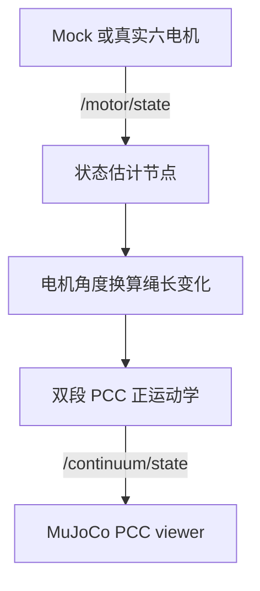

# MuJoCo 实时 PCC 显示说明

## 1. 这一步显示的是什么

MuJoCo 窗口显示的是根据六台电机反馈计算得到的 PCC 理论构型，当前不是柔性体动力学仿真。

MuJoCo XML 使用标定文件中的实际盘间距。恒曲率弯曲角和轴向变化会按照每个盘间单元的实际长度分配，而不是假设五个单元完全等长。

每次启动时，系统先读取当前 `robot_calibration.yaml`，在 `~/.ros/ros_robot1/mujoco/` 生成运行时 MJCF；生成成功后才打开 Viewer。因此修改标定尺寸后不需要手工同步第二份 XML。

数据只走一条正式链路：



因此 Mock 和实机不会使用两套不同的 PCC 接口。以后实机运行时，只需要把电机反馈源从 Mock 切换为 SocketCAN。

## 2. Mock 模式为什么不需要 IMU 和相机

Mock 电脑通常没有双 IMU 和 AprilTag 相机。启动文件会令状态估计器进入 `pcc_only_mode`：

- 保留真实的电机角度、卷线轮半径、方向符号、绳长映射和 PCC 正运动学；
- 只关闭缺失的 IMU 姿态修正和视觉位置融合；
- 不会伪造 IMU 或视觉数据。

实机模式 `use_mock_hardware:=false` 时，`pcc_only_mode` 自动关闭。

## 3. 启动前检查

```bash
python3 -c "import mujoco; print(mujoco.__version__)"
python3 tools/validate_motor_closed_loop.py
python3 tools/validate_mujoco_pcc_integration.py
```

第一条命令失败表示当前运行 ROS 2 的 Python 环境没有 MuJoCo。先不要修改代码，把完整错误发回继续处理环境。

## 4. 一键启动 Mock、PCC 和 MuJoCo

```bash
source /opt/ros/jazzy/setup.bash
source install/setup.bash
ros2 launch robot_bringup motor_pcc_mujoco.launch.py
```

正常情况下会同时出现：

- `/motor/state` 六电机反馈；
- `/continuum/state` 双段 PCC 状态；
- MuJoCo 图形窗口；
- 控制器保持 `DISABLED`，等待人工使能。

如果电脑没有桌面显示环境，可以暂时关闭窗口节点：

```bash
ros2 launch robot_bringup motor_pcc_mujoco.launch.py use_mujoco:=false
```

## 5. 实机显示

实机不是只把 `use_mock_hardware` 改成 false 就立刻使能。必须先完成双 CAN、双 IMU、运行时 IMU 零位、视觉和安全状态检查。

完整外围设备已经运行后，PCC/MuJoCo链可以使用：

```bash
ros2 launch robot_bringup motor_pcc_mujoco.launch.py \
  use_mock_hardware:=false \
  require_safety_state:=true \
  start_imu:=true \
  start_enabled:=false
```

MuJoCo 只读取状态，不向电机发送任何控制命令。关闭 MuJoCo 窗口不会改变电机目标，但真实运动仍必须由急停和闭环看门狗保护。

## 6. 常见问题

| 现象 | 检查内容 |
|---|---|
| 找不到启动文件 | 是否编译了新工程并重新 `source install/setup.bash` |
| `No module named mujoco` | ROS 2 当前使用的 Python 环境未安装 MuJoCo |
| 窗口出现但模型不动 | 检查 `/motor/state` 和 `/continuum/state` 是否持续发布 |
| `pcc_model_valid: false` | 检查标定文件、六电机反馈以及绳长/PCC映射日志 |
| `missing joints` | 生成 XML 与 `intervals_per_section` 不一致 |
| `ContinuumState timeout` | 状态估计节点停止，窗口会冻结在最后一个安全姿态 |
| `DISPLAY` 或 GLFW 报错 | 当前终端没有可用图形桌面，先用 `use_mujoco:=false` |
